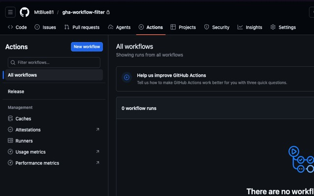

# GHA Workflow Filter

GitHub Actionsのワークフロー一覧ページで、左サイドバーのワークフローを表示名でリアルタイムにフィルタリングできるChrome拡張です。

## 機能

- ワークフロー名によるインクリメンタル検索（大文字小文字無視）
- 全ワークフローの自動読み込み（ページネーション対応）
- GitHub SPA遷移に対応（ページ遷移後も再表示）
- Escapeキーでフィルタクリア
- GitHub ライト/ダークテーマ対応

## スクリーンショット

## インストール

1. このリポジトリをクローンまたはダウンロード
2. Chromeで `chrome://extensions/` を開く
3. 右上の「デベロッパーモード」を有効にする
4. 「パッケージ化されていない拡張機能を読み込む」をクリック
5. このディレクトリを選択

## 使い方

1. GitHub上の任意のリポジトリのActionsページ（`/{owner}/{repo}/actions`）を開く
2. 左サイドバーのワークフローリスト上部にフィルタ入力欄が表示される
3. ワークフロー名を入力するとリアルタイムでフィルタされる
4. クリアボタン（×）またはEscapeキーでフィルタを解除

## 備考

以下２つのリポジトリを参考にさせてもらっています。

- https://github.com/d-kimuson/github-actions-search
- https://github.com/kimuchanman/gha-workflows-folder
